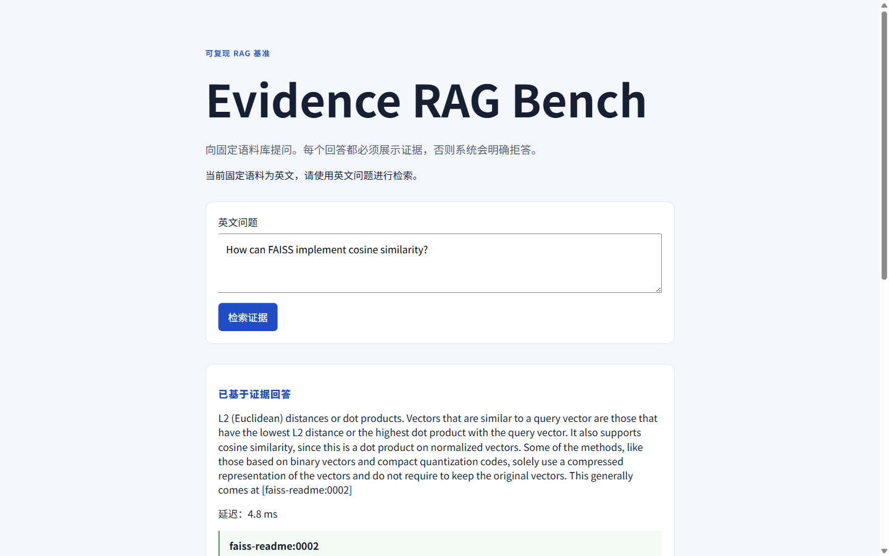
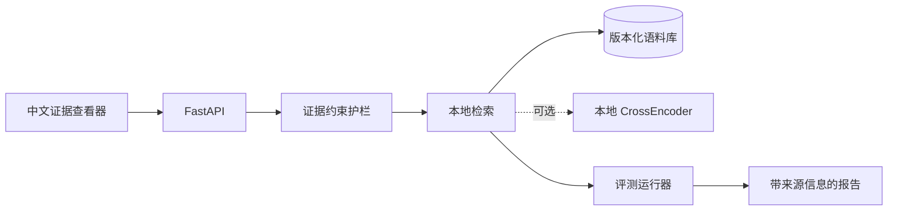

<div align="center">
  <h1>Evidence RAG Bench｜RAG 检索与引用实验</h1>
  <p>把 RAG 找到的段落和引用摊开来看看。</p>
  <p>
    <a href="https://github.com/SCUliujiacheng/evidence-rag-bench-zh/actions/workflows/ci.yml"></a>
    
    <a href="LICENSE"></a>
  </p>
  <p>
    <a href="#这个项目从哪儿来">项目起点</a> ·
    <a href="#我具体测了什么">实验内容</a> ·
    <a href="#架构">架构</a> ·
    <a href="#本地运行">本地运行</a> ·
    <a href="#这些结果不能说明什么">结果边界</a> ·
    <a href="https://github.com/SCUliujiacheng/evidence-rag-bench">English</a>
  </p>
</div>

<p align="center">
  
</p>

## 这个项目从哪儿来

我想把一个问题弄清楚：RAG 回答得很顺时，它到底找到了什么？如果答案对应不到具体段落，我就没法判断检索是否真的命中。

我固定了一小套英文技术文档，在同一批分块上比较 BM25、TF-IDF、RRF Hybrid 与可选的 CrossEncoder 重排，并加了两条简单规则：引用只能指向本次返回的证据；分数不够就 `abstain`。测试集曾经被查看过，这件事也直接写在文档里。

## 我具体测了什么

| 想弄清的问题 | 这里怎么做 |
| --- | --- |
| 同一问题能再跑一遍吗？ | 15 份带许可证的英文技术文档会在分块前做 SHA-256 哈希锁定；[语料清单](data/corpus/open_source_manifest.jsonl)和校验代码都在仓库中。 |
| 为什么演示用 Hybrid？ | 在同一批分块上比较 BM25、词级 + 双词组 TF-IDF 与 RRF Hybrid。BM25 的覆盖率更高，Hybrid 保留正的 TF-IDF 相关性分数，能用于拒答；因此默认演示使用 Hybrid。可选本地 `cross-encoder/ms-marco-MiniLM-L6-v2` 只重排 Hybrid 前 10 个候选，设置见[基准结果](docs/benchmark-results.md)。 |
| 引用真的来自这次返回的证据吗？ | `answer` 的引用 ID 必须属于返回的证据；低置信度返回结构化 `abstain`。具体规则在[证据约束服务](src/evidence_rag_bench/grounding/service.py)。 |
| 某次运行到底发生了什么？ | 报告保留语料清单哈希、Git revision、配置、延迟和逐样本轨迹；还可查看[可交互架构图](docs/architecture/evidence-rag-bench-architecture.html)。 |

### 当前测试集快照结果（protocol v0.1，`k=3`）

| 检索器 | Recall@3 | MRR@3 | nDCG@3 |
| --- | ---: | ---: | ---: |
| BM25 | **0.90** | 0.66 | 0.72 |
| TF-IDF (word + bigram) | 0.86 | 0.62 | 0.68 |
| RRF Hybrid | **0.90** | 0.67 | 0.73 |
| Hybrid + MiniLM CrossEncoder re-rank | 0.86 | **0.74** | **0.77** |

RRF Hybrid 在 Recall@3 上与 BM25 同为 0.90，MRR@3 / nDCG@3 为 0.67 / 0.73。它还保留 TF-IDF 相关性分数，可以直接拿来设拒答阈值。CrossEncoder 将未四舍五入的 MRR@3 从 0.667 提升到 0.738、nDCG@3 从 0.728 提升到 0.769，但 Recall@3 从 0.905 降到 0.857，并带来约 400 ms p50、690 ms p95 的 CPU 延迟。

先把分母说清楚：语料只有 15 份文档；CrossEncoder 是相关性模型，不是蕴含校验器；引用 ID 有效也不代表答案必然由引用支持。测试集结果已在开发过程中被查看，所以当前结果只当作回归快照。完整协议、失败案例和端到端拒答指标见[基准结果](docs/benchmark-results.md)。

## 架构

[打开可交互架构图](docs/architecture/evidence-rag-bench-architecture.html)，查看请求、检索、证据约束与评测如何连起来；[JSON 源文件](docs/architecture/evidence-rag-bench.architecture.json)也一并保留，方便核对图里的说法。



## 本地运行

需要 Python 3.12 与 [uv](https://docs.astral.sh/uv/)：

**PowerShell**

```powershell
uv sync --python 3.12
uv run pytest -v
uv run python -m evidence_rag_bench.evaluation.runner `
  --split dev `
  --k 3 `
  --retriever hybrid `
  --manifest open_source_manifest.jsonl `
  --cases open_source_dev.jsonl
uv run uvicorn evidence_rag_bench.api.app:create_app `
  --factory `
  --port 8000
```

<details>
<summary>Bash / Git Bash 等价命令</summary>

```bash
uv sync --python 3.12
uv run pytest -v
uv run python -m evidence_rag_bench.evaluation.runner \
  --split dev \
  --k 3 \
  --retriever hybrid \
  --manifest open_source_manifest.jsonl \
  --cases open_source_dev.jsonl
uv run uvicorn evidence_rag_bench.api.app:create_app \
  --factory \
  --port 8000
```

</details>

打开 `http://127.0.0.1:8000/`。当前固定语料为英文，因此演示问题也应使用英文；默认 Hybrid 路径不需要 API key 或 GPU。

<details>
<summary>旧 Windows 工作区出现语料 checksum mismatch</summary>

新的字节保留规则会自动应用于全新检出。如果仓库是在该规则加入前检出的，请先确认 `git status --short -- data/corpus` 没有输出，再仅刷新一次受版本控制的语料文件：

```text
git rm -r --cached -- data/corpus
git restore --source=HEAD --staged --worktree -- data/corpus
```

</details>

复现可选的语义重排实验：

```powershell
uv sync --extra semantic --python 3.12
uv run --extra semantic python `
  -m evidence_rag_bench.evaluation.runner `
  --split test `
  --retriever semantic-rerank `
  --k 3 `
  --manifest open_source_manifest.jsonl `
  --cases open_source_test.jsonl
```

<details>
<summary>Bash / Git Bash 等价命令</summary>

```bash
uv sync --extra semantic --python 3.12
uv run --extra semantic python \
  -m evidence_rag_bench.evaluation.runner \
  --split test \
  --retriever semantic-rerank \
  --k 3 \
  --manifest open_source_manifest.jsonl \
  --cases open_source_test.jsonl
```

</details>

## API 示例

保留英文问题是有意为之：固定语料和词法基线均面向英文。

```powershell
$body = @{
  question = "How can FAISS implement cosine similarity?"
  top_k = 3
} | ConvertTo-Json

Invoke-RestMethod `
  -Method Post `
  -Uri "http://127.0.0.1:8000/v1/ask" `
  -ContentType "application/json" `
  -Body $body
```

<details>
<summary>Bash / Git Bash 等价命令</summary>

```bash
curl -X POST http://127.0.0.1:8000/v1/ask \
  -H "content-type: application/json" \
  --data '{
    "question": "How can FAISS implement cosine similarity?",
    "top_k": 3
  }'
```

</details>

接口目前返回 `status`、`answer`、`reason`、`citations`、`evidence`、`latency_ms`、`trace_id` 与 `mode`。`status` 取 `answer` 或 `abstain`；回答中的 citation ID 必须指向本次返回的 evidence，拒答时则不生成引用。

## 这些结果不能说明什么

版本化 JSONL 用例按标准证据 ID 计算 Recall@k、MRR@k 与 nDCG@k。加载器拒绝重复案例 ID、重复规范化问题、跨数据集复用问题，以及与可回答性冲突的标签。拒答阈值只由开发集选择，测试集不会参与阈值校准。

项目早期查看过测试集结果来比较检索器，测试集也随语料扩展从 8 条增加到 25 条。当前演示默认值参考过这些结果，它就不再是严格意义上的盲测集；这里把它当作可复现的回归快照。自 v0.1 起，新的模型和参数先在开发集确定；若测试集扩容，则提升 protocol version 并保留旧快照。要谈新的泛化结论，需要另建从未查看且封存的测试集。这个限制也记录在[决策日志](docs/decision-log.md)中。

运行生成的报告写入忽略追踪的 `artifacts/reports/`，保留 `corpus_manifest_sha256`、`git_revision`、`created_at`、retriever 配置、metrics 与逐案例 trace，便于复查而不会把临时结果误当成源码。

进一步阅读：[数据归属](docs/data-attribution.md)、[基准结果](docs/benchmark-results.md)、[可选语义重排协议](docs/semantic-reranking.md)、[决策日志](docs/decision-log.md)、[人工评测量表](docs/evaluation-rubric.md)。

## 许可证（License）

项目代码采用 [MIT License](LICENSE)。语料文档继续适用各自上游许可证，详见[数据归属](docs/data-attribution.md)。
