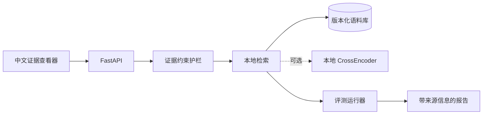

<div align="center">
  <h1>Evidence RAG Bench｜证据驱动的 RAG 评测基准</h1>
  <p>让检索结果可复现、引用可校验，并在证据不足时明确拒答。</p>
  <p>
    <a href="https://github.com/SCUliujiacheng/evidence-rag-bench-zh/actions/workflows/ci.yml"></a>
    
    <a href="LICENSE"></a>
  </p>
  <p>
    <a href="#我为什么做这个项目">为什么做</a> ·
    <a href="#3-分钟设计速览">设计速览</a> ·
    <a href="#架构">架构</a> ·
    <a href="#本地运行">本地运行</a> ·
    <a href="#评测边界与已知限制">评测边界</a> ·
    <a href="https://github.com/SCUliujiacheng/evidence-rag-bench">English</a>
  </p>
</div>

<p align="center">
  
</p>

## 我为什么做这个项目

我对 RAG 最感兴趣的，不只是它能不能生成一段看起来合理的回答，而是回答能否追溯到具体证据：检索结果能否复现，引用是否确实来自返回的证据，以及证据不足时系统是否愿意明确说“不知道”。因此，我把评测协议、语料哈希、逐样本轨迹和结构化拒答放在实现的核心位置，也如实记录测试集曾被查看等边界。这个项目是我对“可验证的 RAG 应该怎样设计”的一次工程化实践。

项目校验语料来源，比较 BM25、TF-IDF、RRF Hybrid 与可选 CrossEncoder 重排，并保证每个回答引用都能在证据列表中找到；证据不足时，系统会明确拒答。

## 3 分钟设计速览

| 设计关注点 | 对应实现证据 |
| --- | --- |
| 问题定义 | RAG 不只要“能回答”，还要能复现检索结果、校验引用，并在证据不足时安全拒答。 |
| 数据协议 | 15 份带许可证、SHA-256 哈希锁定的英文技术文档；开发集（dev）与固定测试集（test）各 25 条，每组含 21 条证据标注与 4 条歧义/域外问题。拒答阈值只用开发集校准，可直接检查[语料清单](data/corpus/open_source_manifest.jsonl)。 |
| 检索系统 | 同一分块上比较 BM25、词级 + 双词组 TF-IDF、RRF Hybrid；可选本地 `cross-encoder/ms-marco-MiniLM-L6-v2` 重排 Hybrid 的前 10 个候选，完整设置见[基准结果](docs/benchmark-results.md)。 |
| 可信约束 | `answer` 的引用 ID 必须属于返回的证据；低置信度返回结构化 `abstain`。报告记录语料清单哈希、Git revision、配置、延迟与逐样本轨迹，对应实现见[证据约束服务](src/evidence_rag_bench/grounding/service.py)。 |
| 工程交付 | FastAPI API、浏览器演示、可复现 CLI、pytest/ruff CI、机器可读 JSON 报告与[可交互架构图](docs/architecture/evidence-rag-bench-architecture.html)。 |

### 当前测试集快照结果（protocol v0.1，`k=3`）

| 检索器 | Recall@3 | MRR@3 | nDCG@3 |
| --- | ---: | ---: | ---: |
| BM25 | **0.90** | 0.66 | 0.72 |
| TF-IDF (word + bigram) | 0.86 | 0.62 | 0.68 |
| RRF Hybrid | **0.90** | 0.67 | 0.73 |
| Hybrid + MiniLM CrossEncoder re-rank | 0.86 | **0.74** | **0.77** |

RRF Hybrid 在 Recall@3 上与 BM25 同为 0.90，并把 MRR@3 / nDCG@3 做到 0.67 / 0.73；它保留 TF-IDF 相关性信号，便于实现确定性的拒答阈值。CrossEncoder 将未四舍五入的 MRR@3 从 0.667 提升到 0.738、nDCG@3 从 0.728 提升到 0.769，但 Recall@3 从 0.905 降到 0.857，并带来约 400 ms p50、690 ms p95 的 CPU 延迟。

这些数字的边界同样重要：语料规模只有 15 份文档；CrossEncoder 是相关性模型，不是蕴含校验器；引用 ID 有效不等于答案在语义上必然由引用支持。固定测试集的结果已经在开发过程中被查看，因此这里把它作为可复现回归集，而不包装成未见数据上的泛化证明。完整协议、失败案例和端到端拒答指标见[基准结果](docs/benchmark-results.md)。

## 架构

[打开可交互架构图](docs/architecture/evidence-rag-bench-architecture.html)，查看请求、检索、证据约束与评测路径；其可审查的 [JSON 规范](docs/architecture/evidence-rag-bench.architecture.json) 与 HTML 一同纳入版本控制。



## 本地运行

需要 Python 3.12 与 [uv](https://docs.astral.sh/uv/)：

```bash
uv sync --python 3.12
uv run pytest -v
uv run python -m evidence_rag_bench.evaluation.runner \
  --split dev \
  --k 3 \
  --retriever hybrid \
  --manifest open_source_manifest.jsonl \
  --cases open_source_dev.jsonl
uv run uvicorn evidence_rag_bench.api.app:create_app \
  --factory \
  --port 8000
```

打开 `http://127.0.0.1:8000/`。当前固定语料为英文，因此演示问题也应使用英文；默认 Hybrid 路径不需要 API key 或 GPU。

复现可选的语义重排实验：

```bash
uv sync --extra semantic --python 3.12
uv run --extra semantic python \
  -m evidence_rag_bench.evaluation.runner \
  --split test \
  --retriever semantic-rerank \
  --k 3 \
  --manifest open_source_manifest.jsonl \
  --cases open_source_test.jsonl
```

## API 示例

保留英文问题是有意为之：固定语料和词法基线均面向英文。

```bash
curl -X POST http://127.0.0.1:8000/v1/ask \
  -H "content-type: application/json" \
  --data '{
    "question": "How can FAISS implement cosine similarity?",
    "top_k": 3
  }'
```

响应字段与协议值保持稳定：`status` 为 `answer` 或 `abstain`，并包含 `answer`、`reason`、`citations`、`evidence`、`latency_ms`、`trace_id` 与 `mode`。`answer` 响应中的 citation ID 必须引用返回的 evidence；`abstain` 不会编造引用。

## 评测边界与已知限制

版本化 JSONL 用例按标准证据 ID 计算 Recall@k、MRR@k 与 nDCG@k。加载器拒绝重复案例 ID、重复规范化问题、跨数据集复用问题，以及与可回答性冲突的标签。拒答阈值只由开发集选择，测试集不会参与阈值校准。

需要明确披露的是：项目早期曾查看测试集结果来比较检索器，测试集也随语料扩展从 8 条增加到 25 条；当前演示默认值参考过这些结果，所以它已经不是严格意义上的盲测集。本仓库将当前版本定位为可复现的回归快照。自 v0.1 起，新的模型和参数先在开发集确定；若测试集扩容，则提升 protocol version 并保留旧快照。新的泛化结论需要另建从未查看且封存的测试集。这个限制也记录在[决策日志](docs/decision-log.md)中。

运行生成的报告写入忽略追踪的 `artifacts/reports/`，保留 `corpus_manifest_sha256`、`git_revision`、`created_at`、retriever 配置、metrics 与逐案例 trace，便于复查而不会把临时结果误当成源码。

进一步阅读：[数据归属](docs/data-attribution.md)、[基准结果](docs/benchmark-results.md)、[可选语义重排协议](docs/semantic-reranking.md)、[决策日志](docs/decision-log.md)、[人工评测量表](docs/evaluation-rubric.md)。

## 许可证（License）

项目代码采用 [MIT License](LICENSE)。语料文档继续适用各自上游许可证，详见[数据归属](docs/data-attribution.md)。
