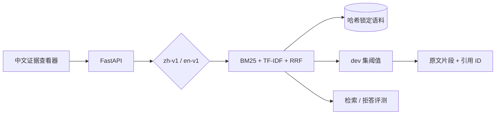

<div align="center">
  <h1>Evidence RAG Bench｜RAG 证据检索实验</h1>
  <p>把检索到的原文、引用和拒答边界一起摊开来看。</p>
  <p>
    <a href="https://github.com/SCUliujiacheng/evidence-rag-bench-zh/actions/workflows/ci.yml"></a>
    
    <a href="LICENSE"></a>
  </p>
  <p>
    <a href="#项目起点">项目起点</a> ·
    <a href="#中文语料">中文语料</a> ·
    <a href="#实测结果">实测结果</a> ·
    <a href="#本地运行">本地运行</a> ·
    <a href="#结果边界">结果边界</a> ·
    <a href="https://github.com/SCUliujiacheng/evidence-rag-bench">English</a>
  </p>
</div>

<p align="center">
  
</p>

## 项目起点

我一直想把一个问题弄清楚：RAG 看起来答得很顺时，它到底找到了什么？如果一句话对应不到具体原文，我就没法判断检索是真的命中，还是只碰巧找到了相似词。

所以我把这个项目做成了一个小型证据查看器：同一份语料分别跑 BM25、TF-IDF 和 RRF Hybrid；命中后直接展示原文片段和稳定引用 ID；相关性分数太低就拒答。项目不会调用在线大模型，默认路径不需要 API key 或 GPU。

页面现在默认使用中文语料。英文实验仍完整保留在 `en-v1`，方便检查原有回归结果有没有被中文支持破坏。

## 中文语料

`zh-v1` 固定了三份中文开源文档：Milvus、PaddlePaddle 和 FlagEmbedding 的 README。每份文件都锁定到具体 commit，保存原始字节、许可证副本与 SHA-256；详细来源见[数据归属](docs/data-attribution.md)。

| profile | 默认用途 | 分块 | 分词 | dev / test |
| --- | --- | --- | --- | ---: |
| `zh-v1` | 中文界面与中文检索 | 220 个 Unicode 可见单元，重叠 40 | CJK bigram + Latin word | 9 / 9 |
| `en-v1` | 原英文回归基准 | 80 词，重叠 20 | English word | 25 / 25 |

中文分词器只用 Python 标准库：连续中文生成双字片段，英文和数字转成小写词元；像 `BGE-M3` 会拆成 `bge` 与 `m3`。分块直接切原文范围，不会把中文改写成带空格的文本。

Milvus README 的后半部分是贡献者头像 HTML。原文件仍按上游字节完整保存，但建索引时在 `### All contributors` 前停止。去掉这部分后，中文索引由 54 个可读 chunk 组成，而不是让头像链接占掉大多数候选。报告会同时记录原 manifest 哈希、实际索引内容哈希和这条截断规则。

## 实测结果

下面是 `zh-v1` 固定 test 回归集的结果，`k=3`：

| 检索器 | Recall@3 | MRR@3 | nDCG@3 |
| --- | ---: | ---: | ---: |
| BM25 | 0.917 | **1.000** | 0.936 |
| TF-IDF | **1.000** | **1.000** | **0.987** |
| RRF Hybrid | **1.000** | **1.000** | **0.987** |

Hybrid 作为演示默认值，不是因为这张小表能证明它普遍更好，而是因为它同时保留了 BM25 / TF-IDF 的排序结果和一个可用于拒答的 TF-IDF 相关性分数。完整的 dev、test、英文回归和逐案例失败分析见[基准结果](docs/benchmark-results.md)。

端到端检查也保留了不好看的数字。只用中文 dev 集校准得到阈值 `0.175402` 后，test 的引用 ID 有效率为 1.00，但错误回答率仍是 0.67。明显域外的问题能被挡住；“原文相关但没有给出所问细节”或“要求偏好判断”的问题，单一词法分数仍可能放行。页面因此写的是“已找到相关证据，请核对下方原文”，而不是声称系统已经回答正确。

## 运行路径



[打开可交互架构图](docs/architecture/evidence-rag-bench-architecture.html)可以沿请求、检索、证据约束和报告逐层查看；[JSON 源文件](docs/architecture/evidence-rag-bench.architecture.json)也在仓库中。

## 本地运行

需要 Python 3.12 与 [uv](https://docs.astral.sh/uv/)：

```powershell
uv sync --python 3.12
uv run pytest -v

# 中文检索回归
uv run python -m evidence_rag_bench.evaluation.runner `
  --profile zh-v1 --split test --retriever hybrid --k 3

# 中文端到端拒答检查；阈值自动取自 zh-v1 dev
uv run python -m evidence_rag_bench.evaluation.runner `
  --profile zh-v1 --split test --retriever hybrid --k 3 --mode grounded

uv run uvicorn evidence_rag_bench.api.app:create_app --factory --port 8000
```

<details>
<summary>Bash / Git Bash 等价命令</summary>

```bash
uv sync --python 3.12
uv run pytest -v
uv run python -m evidence_rag_bench.evaluation.runner \
  --profile zh-v1 --split test --retriever hybrid --k 3
uv run python -m evidence_rag_bench.evaluation.runner \
  --profile zh-v1 --split test --retriever hybrid --k 3 --mode grounded
uv run uvicorn evidence_rag_bench.api.app:create_app --factory --port 8000
```

</details>

打开 `http://127.0.0.1:8000/`。页面默认选择 `zh-v1`，也可以直接切换到 `en-v1`。

## API 示例

```powershell
$body = @{
  profile = "zh-v1"
  question = "Milvus 为什么同时支持流处理和批处理？"
  top_k = 3
} | ConvertTo-Json

Invoke-RestMethod `
  -Method Post `
  -Uri "http://127.0.0.1:8000/v1/ask" `
  -ContentType "application/json" `
  -Body $body
```

返回值包含 `profile`、`status`、`answer`、`reason`、`citations`、`evidence`、`latency_ms`、`trace_id` 与 `mode`。这里沿用 `answer` 字段名以兼容原接口；它装的是排名第一的原文片段，不是生成式答案。`status=answer` 只表示超过词法阈值且引用 ID 有效。

可选 MiniLM CrossEncoder 只支持 `en-v1`。当前模型按英文 MS MARCO 训练，`zh-v1` 会明确拒绝 `semantic-rerank`，不会悄悄给出一组看似可比的中文数字。英文复现实验见[语义重排说明](docs/semantic-reranking.md)。

## 结果边界

这套中文 dev / test 各只有 9 个问题，语料也只有 3 份 README。测试集和结果在开发过程中已经被查看，所以它是固定回归集，不是仍然封存的盲测集，也不能拿来证明对其他领域的泛化。

还有一个更重要的边界：引用 ID 属于返回证据，只能证明“这段原文确实被检索并展示”，不能证明原文蕴含了某个自然语言结论。当前 score-only 护栏比较擅长拒绝明显域外问题，不擅长判断相关段落是否包含足够细节。要解决后者，需要另做语义支持度标注和 verifier，并用未查看的新数据验收。

运行报告写入未跟踪的 `artifacts/reports/`。每份报告保留 `corpus_manifest_sha256`、`indexed_corpus_sha256`、`index_scope`、Git revision、profile、分块/分词配置、指标与逐案例轨迹。

进一步阅读：[数据归属](docs/data-attribution.md)、[基准结果](docs/benchmark-results.md)、[决策日志](docs/decision-log.md)、[人工评测量表](docs/evaluation-rubric.md)。

## 许可证

项目代码采用 [MIT License](LICENSE)。语料继续适用各自的上游许可证，详见[数据归属](docs/data-attribution.md)。
