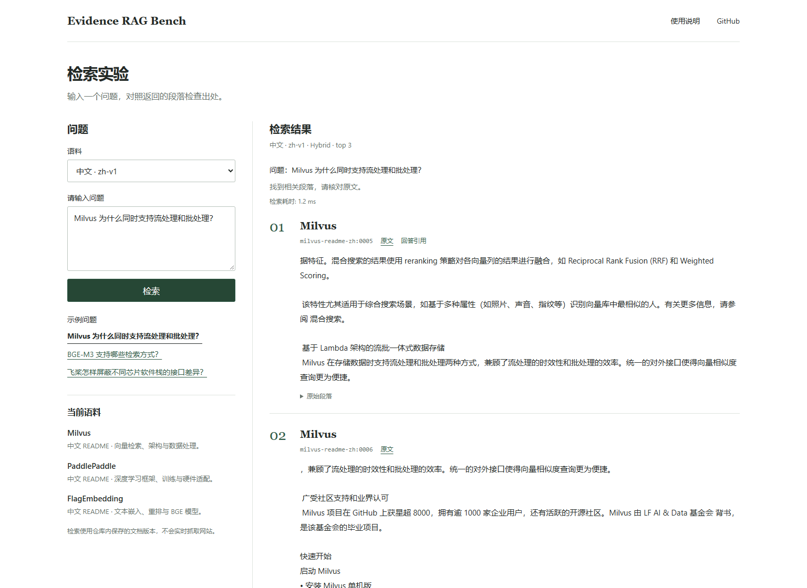

# Evidence RAG Bench

一个中英文检索实验，记录命中的原文、排序和拒答结果。

[English](https://github.com/SCUliujiacheng/evidence-rag-bench) · [实验记录](docs/benchmark-results.md) · [设计笔记](docs/decision-log.md) · [CI](https://github.com/SCUliujiacheng/evidence-rag-bench-zh/actions/workflows/ci.yml)

检索到一段相关文档以后，还有一个问题：它有没有给出问题所要的细节？例如，飞桨的文档提到自动并行会搜索高效策略，却没有写明具体的搜索算法。这样的片段可以有很高的检索分数，但仍不足以回答算法名称。

这个仓库用固定的中英文技术文档比较 BM25、TF-IDF 和 RRF Hybrid，再检查引用和拒答。页面可以直接查看命中的片段，CLI 则记录逐题结果。当前实现返回原文摘录，不调用生成模型；默认运行不需要 API key 或 GPU。



## 语料与实验

| 配置 | 语料 | 分块方式 | dev / test |
| --- | --- | --- | ---: |
| `zh-v1` | Milvus、PaddlePaddle、FlagEmbedding 的 3 份中文 README | 220 个可见 Unicode 单元，重叠 40 | 9 / 9 |
| `en-v1` | FAISS、scikit-learn、LangChain 的 15 份英文文档 | 80 词，重叠 20 | 25 / 25 |

两套配置独立建索引、标注和选择阈值。中文使用 CJK 双字片段与英文/数字词元；`BGE-M3` 会拆为 `bge` 和 `m3`。分块保留原文中的标点和换行。

语料随仓库保存并校验 SHA-256，中文文件还固定了上游 commit。Milvus README 的贡献者头像区不参与索引，完整原文件仍保留；中文索引共 54 个片段。来源、许可证和索引范围见[语料说明](docs/data-attribution.md)。

下面是中文固定测试集的结果，`k=3`。检索指标只计算其中 6 道有标准证据的问题：

| 检索器 | Recall@3 | MRR@3 | nDCG@3 |
| --- | ---: | ---: | ---: |
| BM25 | 0.917 | 1.000 | 0.936 |
| TF-IDF | 1.000 | 1.000 | 0.987 |
| RRF Hybrid | 1.000 | 1.000 | 0.987 |

拒答检查暴露了另一个问题：Hybrid 在 3 道不应回答的题目中放行了 2 道，包括开头的飞桨问题；同时误拒绝了 1 道可回答的问题。阈值来自 dev 集，为 `0.175402`。这组结果说明，在当前语料上，词法分数可以找对主题，却不足以判断细节是否齐全。[完整实验记录](docs/benchmark-results.md)保留了每类指标和失败案例。

## 本地运行

需要 Python 3.12 和 [uv](https://docs.astral.sh/uv/)。以下命令在 PowerShell 和 Bash 中均可直接运行：

```text
uv sync --python 3.12
uv run uvicorn evidence_rag_bench.api.app:create_app --factory --port 8000
```

打开 `http://127.0.0.1:8000/`。默认使用中文语料，也可以在页面切换为英文。可以先问：`Milvus 为什么同时支持流处理和批处理？`

另开一个终端运行评测：

```text
uv run python -m evidence_rag_bench.evaluation.runner --profile zh-v1 --split test --retriever hybrid --k 3
uv run python -m evidence_rag_bench.evaluation.runner --profile zh-v1 --split test --retriever hybrid --k 3 --mode grounded
uv run pytest -v
```

第一条评测检索排序，第二条同时检查拒答和引用。将 `zh-v1` 改为 `en-v1` 可复现英文实验；将 `hybrid` 改为 `bm25` 或 `tfidf` 可比较检索器。报告保存在 `artifacts/reports/`，包含配置、语料哈希、Git revision 和逐题记录。

API 文档位于 `http://127.0.0.1:8000/docs`。一次中文查询的请求体为：

```json
{
  "profile": "zh-v1",
  "question": "Milvus 为什么同时支持流处理和批处理？",
  "top_k": 3
}
```

发送到 `POST /v1/ask`。返回的 `answer` 是排名第一的原文摘录，`status=answer` 表示通过相关性阈值和引用 ID 检查。引用 ID 有效不代表原文已经支持问题中的每个结论。

## 几个取舍

- **保留词法基线。** 三种检索器使用相同片段，差异容易检查。Hybrid 合并两路排序，并保留 TF-IDF 分数供拒答使用；RRF 的名次分数本身不当作置信度。
- **中英文分开评测。** 分块、词元和阈值随语料配置选择，避免把英文阈值直接套到中文。
- **重排作为单独实验。** 可选 MiniLM CrossEncoder 只用于 `en-v1`。它改善了当前英文集上的 MRR 和 nDCG，但 Recall 降低，CPU 延迟也增加。运行方法和结果见[重排实验](docs/semantic-reranking.md)。

[架构图](docs/architecture/evidence-rag-bench-architecture.html)与 [JSON 源文件](docs/architecture/evidence-rag-bench.architecture.json)记录了检索、阈值和评测之间的关系。

## 局限与后续问题

语料规模很小，中文只有 3 份 README。两套 test 都在开发中查看过，现在用于回归检查，不能据此判断跨领域效果。中文 Recall 较高，也与题目使用了文档中的术语有关。

下一步值得测试的是同义改写和“主题相关、细节缺失”的问题。前者可以检查词法检索的覆盖范围，后者需要额外的语义支持度标注。新模型或阈值先在 dev 上比较；若要讨论泛化，还需要另建未参与开发的测试集。

更多细节：[设计笔记](docs/decision-log.md)、[人工评测量表](docs/evaluation-rubric.md)、[语料与许可证](docs/data-attribution.md)。代码使用 [MIT License](LICENSE)，语料保留上游许可证。
